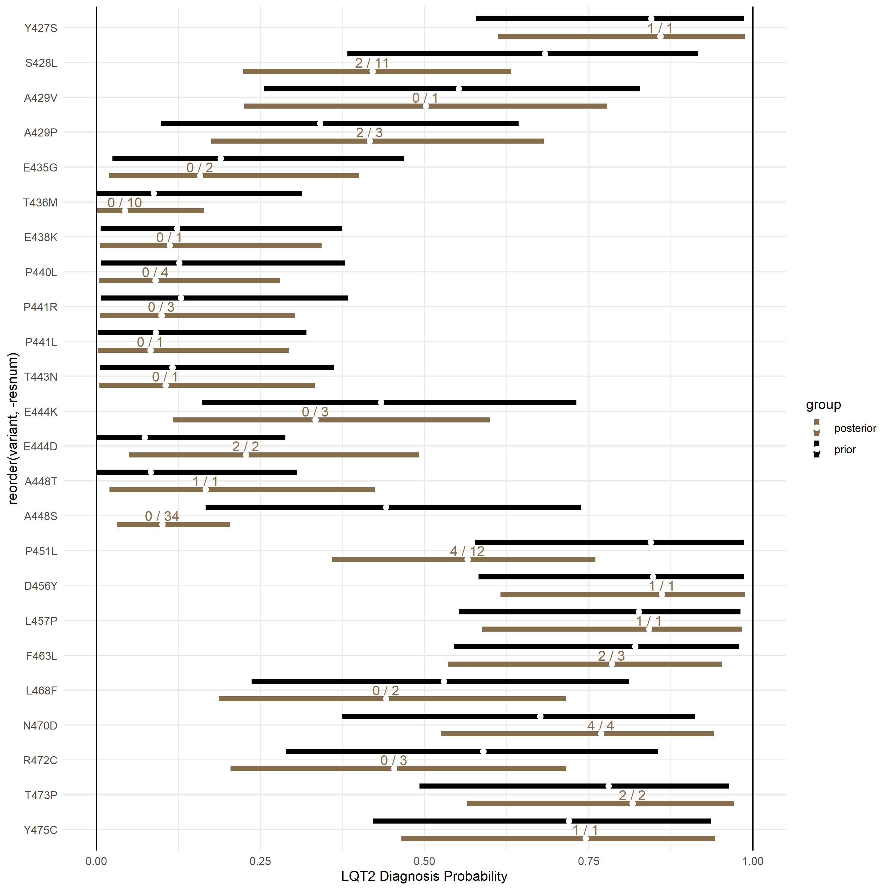
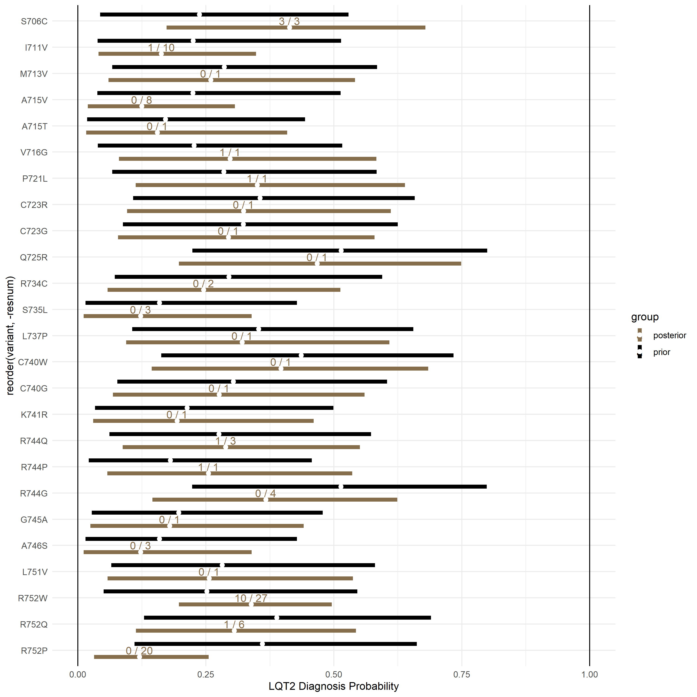
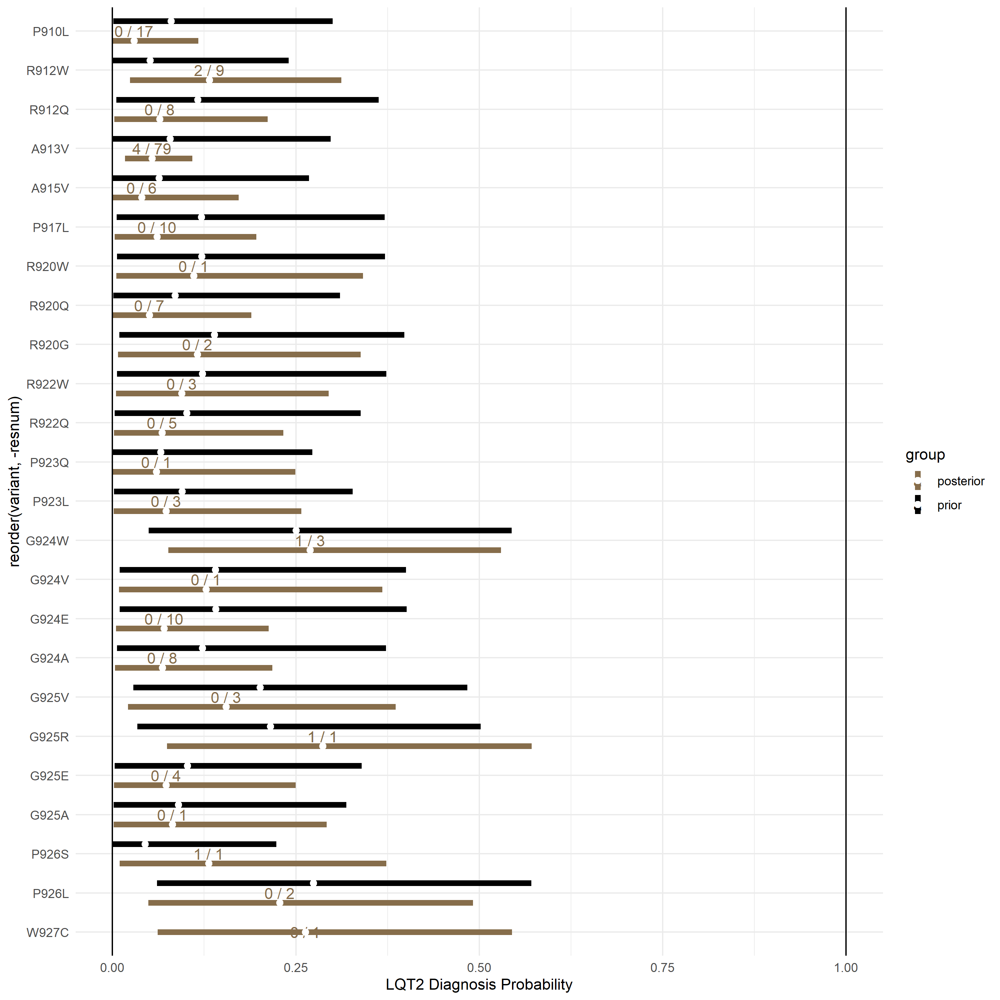

```{r preamble,include=FALSE}
knitr::opts_chunk$set(echo = TRUE)

library("nnet")
library("DBI")
library("RSQLite")
library(dplyr)
library(ggplot2)
library(ggpubr)
library(caret)
library(plotrix)
library(glmnet)
library(meta)
library(reshape2)
library(psych)
require(Hmisc)
library(tableone)
library(wCorr)
library(rms)
library(boot)
library(leaps)
library(car)
library(reticulate)
library(rootSolve)
library(pROC)
library(wCorr)
library(MALDIquant)
library(tidyverse)      # data manipulation and visualization
library(lubridate)      # easily work with dates and times
library(fpp2)           # working with time series data
library(zoo)            # working with time series data
library(latex2exp)
library(forestplot)
library(ggplot2)

setwd("/Users/KRONCKE/Box Sync/Kroncke_Lab/GitHub/Bayes_KCNH2_LQT2_Penetrance/")
source('func_dist_seq.R')
load("prepared_data.RData")

# Include distances between residue centroids from the structure of KV11.1 (KCNH2 protein product) PDB-ID: 5VA1
h2dist<-read.csv(file = "5va1.dists.txt", header = FALSE)

```

# Introduction
This document describes an estimate of the positive predictive value (PPV) of variant discovery for all variants in the gene *KCNH2* on long QT syndrome type 2 (LQT2). Additional details on the methods used are published Kroncke et al. 2020 PLOS Genetics and at the following website: (https://oates.app.vumc.org/vancart/SCN5A/SCN5A-report.html). We use observed and estimated probability of LQT2 diagnosis for all known KCNH2 variants as a way to assess the per variant PPV for variant discovery. Our objective is to develope a prior estimate of the per variant PPV on LQT2 which incorporates structure, function, and *in silico* predictors. We use these *in silico* and *in vitro* data to generate a Bayesian prior estimate of the per variant PPV since these data can be generated in a lab setting, unlike heterozygotes/carriers of *KCNH2* variants which may or may not exist. The final posterior estimate combines this derived prior and clinically phenotyped heterozygotes/carriers.

# Part 1: Calculate probability of LQT2 diagnosis and LQT2 Probability Density using Various Subsets of the Literature and Cohort Data

## All Literature Variants

```{r}

# mut_type has includes type and isoform for all variants in the literature and in the cohort.
mut_type <- mut_type[mut_type$mut_type == "missense",]

# Cohort carrier/heterozygote counts and variant IDs. 
# Here we select only the missense variants (in-frame indels are also included as "missense")
cohort.data <- cohort.data[cohort.data$mut_type == "missense" & cohort.data$total_carriers > 0,]

# Literature dataset where potentially overlapping carriers/heterozygotes are removed
d <- lit.nonoverlap.data[lit.nonoverlap.data$mut_type == "missense",]

# Here, heterozygotes/carriers from gnomAD are removed to test their influence on performance
# Remove comments in next two lines and complete subsequent evaluation to assess influence of gnomAD on
# calculations.
#d$total_carriers <- d$total_carriers - d$gnomAD # test influence of gnomAD
#d$unaff <- d$total_carriers - d$lqt2 # test influence of gnomAD

# set initial weighting and penetrance
d$weight = 1-1/(0.01+d$total_carriers)
d$penetrance_lqt2 <- d$lqt2/d$total_carriers
d[d$total_carriers < 1,"weight"] <- 0.000 # This is changed to "< 2" when evaluating ROC-AUC of n=1 variants from the literature

```

### LQT2 empirical LQTS diagnosis probability prior
Use observed LQT2 diagnosis probability to calculate "LQTS probability density" as described in previous publication. Plot probability density versus residue

```{r}

# Mean squared error
mse <- function(sm) {
  mean((sm$residuals)^2*(sm$weights))
}

# Weighted mean to determine LQT2 penetrance empirical prior
newdata = data.frame(wt=1)
model <- lm(penetrance_lqt2 ~ 1, data=d, weights = d$weight)
summary(model)
p<-predict(model, newdata)
dev<- mse(model)#p*(1-p)

# Derive alpha and beta from weighted mean and MSE (estimated variance)
estBetaParams <- function(mu, var) {
  alpha <- ((1 - mu) / var - 1 / mu) * mu ^ 2
  beta <- alpha * (1 / mu - 1)
  return(params = list(alpha = alpha, beta = beta))
}

# Estimated shape parameters for LQT2 empirical prior
alpha0 = estBetaParams(p,dev)$alpha
beta0 = estBetaParams(p,dev)$beta
print(paste("alpha0 = ", alpha0, "  beta0 = ", beta0))

# Bayesian LQT2 penetrance estimates from empirical priors 
# and observed affected/unaffected counts:
d$lqt2_penetranceBayesian_initial <- (alpha0 + d[,"lqt2"])/((alpha0 + beta0 + d[,"total_carriers"]))
d$lqt2_penetranceBayesian<-d$lqt2_penetranceBayesian_initial

# Plot literature observed LQT2 penetrance versus residue number
m<- d %>% 
  select(resnum, pmean = penetrance_lqt2) %>% 
  mutate(p_mean_smooth = rollmean(pmean, k=20, fill = NA))

fit <- loess(d[,"penetrance_lqt2"]~as.numeric(d[,"resnum"]), span = 0.15)
plot(d$resnum, d$penetrance_lqt2, xlab ="Residue", ylab = "LQT2 Penetrance Estimate")
xrange <- seq(min(fit$x), max(fit$x), length.out = 100)
ps <- predict(fit, xrange, se=T)
lines(xrange, ps$fit*1, lwd=5)
lines(xrange, (ps$fit+1.96*ps$se.fit)*1, lty=2, lwd=4)
lines(xrange, (ps$fit-1.96*ps$se.fit)*1, lty=2, lwd=4)

```

### Calculate LQTS probability densities
With the updated empirical priors applied to carrier counts, calculate "LQTS probability density" as described in previous publication.

```{r}
# NOTE: adjust 3rd argument given to funcdist, "d,", to d[d$total_carriers>1,] when 
# evaluating ROC of total_carriers == 1

h2.covariates[, "lqt2_dist"]<-NA
h2.covariates[, "lqt2_dist_weight"]<-NA
mut_type <- mut_type[mut_type$mut_type == "missense" & mut_type$isoform == "A",]
for(rec in 1:nrow(mut_type)){
  if (!is.na(mut_type[rec, "resnum"])) {
    l<-length(h2.covariates[h2.covariates$var == mut_type[rec, "var"],"var"])
    for (m in 1:l){
    h2.covariates[h2.covariates$var == mut_type[rec, "var"], 
                  c("lqt2_dist", "lqt2_dist_weight", "resnum")][m,] <- c(funcdist(mut_type[rec, "resnum"], mut_type[rec, "var"], d, h2dist, "penetrance_lqt2", "sigmoid", 7), mut_type[rec, "resnum"])
    }
  }
}

# Plot lqt2_dist versus residue number
h2.covariates$resnum<-as.integer(h2.covariates$resnum)
h2.covariates <- h2.covariates[order(h2.covariates$resnum),]
h2.covariates <- h2.covariates[!is.na(h2.covariates$resnum),]
m<- h2.covariates %>% 
  select(resnum, pmean = lqt2_dist) %>% 
  mutate(p_mean_smooth = rollmean(pmean, k=20, fill = NA))

fit <- loess(h2.covariates[,"lqt2_dist"]~as.numeric(h2.covariates[,"resnum"]), span = 0.15)
plot(h2.covariates$resnum, h2.covariates$lqt2_dist, xlab ="Residue", ylab = "LQT2 Penetrance Density", xlim=c(0,1160))
xrange <- seq(min(fit$x), max(fit$x), length.out = 100)
ps <- predict(fit, xrange, se=T)
lines(xrange, ps$fit*1, lwd=5)
lines(xrange, (ps$fit+1.96*ps$se.fit)*1, lty=2, lwd=4)
lines(xrange, (ps$fit-1.96*ps$se.fit)*1, lty=2, lwd=4)

```

### Calculate Weighted Spearman Correlation Coefficients
Evaluate weighted Spearman correlations coefficients between observed LQT2 diagnosis probability in the literature and various potential predictors 

```{r}
# Merge "d" with full variant list and set carrier counts to 0. 
# This is done for convenience so we can estimate LQT2 diagnosis probability for all variants including 
# those witheld during model construction. This will make validation easier.
d <- merge(d, h2.covariates, all = TRUE)
d <- unique(d) 

calcPval=function(xName,yName,weightName,nPerms,new.mat2){
  # Pulls out variables

  x=new.mat2[,xName] 
  y=new.mat2[,yName] 
  w=new.mat2[,weightName]
  x2=x[!is.na(x)]
  y2=y[!is.na(x)]
  w2=w[!is.na(x)]

  # Calculate the real correlation
  realCorr=weightedCorr(x2,y2,method='spearman',weights=w2)
  # Do permutations, calculate fake correlations
  permutedCorrList=c()
  for(permNum in 1:nPerms){
    permutedX=sample(x2,length(x2),replace=FALSE)
    wCorrSim=weightedCorr(permutedX,y2,method='spearman',weights=w2)
    permutedCorrList=c(permutedCorrList,wCorrSim)
  }
  permutedCorrList2=abs(permutedCorrList)
  realCorr2=abs(realCorr)
  
  # Calculate pvalue
  summ=sum(realCorr2<permutedCorrList2)
  pValue=summ/nPerms
  return(list(realCorr,pValue,length(x2)))
}

calcAllPvals=function(yList,xList,nPerms,weightName,new.mat2){
  i=0
  resultTable=data.frame()
  for(yName in yList){
    for(xName in xList){
      i=i+1
      result=calcPval(xName,yName,weightName,nPerms,new.mat2)
      resultTable[i,'x']=xName
      resultTable[i,'y']=yName
      resultTable[i,'nPerms']=nPerms
      resultTable[i,'weightedCorr']=result[[1]]
      resultTable[i,'pValue']=result[[2]]
      resultTable[i,'n']=result[[3]]
      #print(resultTable[i,'pValue'])
    }
  }
  print(resultTable)
  return(resultTable)
}


yList=c('penetrance_lqt2')
xList=c('hm_ssPeak','hm_tailPeak','hm_vhalfact','hm_vhalfinact','hm_recovfrominact', 'hm_taudeact_fast', 
        'ht_ssPeak','ht_tailPeak','ht_vhalfact','ht_vhalfinact','ht_recovfrominact', 'ht_taudeact_fast',
        'pph2_prob', 'provean_score', "blast_pssm",
        'pamscore', 'aasimilaritymat', "lqt2_dist", "revel_score")
tmp<-d[!is.na(d$penetrance_lqt2) & !is.na(d$revel_score),]
resultTable<-calcAllPvals(yList, xList, 1000, 'weight', tmp)

tmp<-d[!is.na(d$ht_tailPeak) & !is.na(d$penetrance_lqt2) & !is.na(d$revel_score),]
resultTable<-calcAllPvals(yList, xList, 1000, 'weight', tmp)

```

### Scale all covariates

```{r,include=FALSE}
# Scale all covariates
covariate_list <- c("pph2_prob", "blast_pssm",  "provean_score", 
 "pamscore", "aasimilaritymat", "hm_ssPeak",  "revel_score",
"hm_tailPeak",  "hm_vhalfact",  "hm_vhalfinact",  "hm_recovfrominact",
"hm_taudeact_fast", "ht_ssPeak", "ht_tailPeak",  "ht_vhalfact",  
"ht_vhalfinact",  "ht_recovfrominact", "ht_taudeact_fast", "lqt2_dist",  
"lqt2_dist_weight")
for (c in covariate_list) {h2.covariates[,c] <- scale(h2.covariates[,c])}

```

### Calculate EM priors and posteriors for all variants
Use an EM algorithm to estimate LQT2 PPV for each variant (or LQT2 diagnosis probability) 

```{r, include=FALSE}
# Assign p_mean_w to empirical penetrance. I need to add the reassignment to ensure
# p_mean_w does not contain "NA"s.
d[is.na(d$lqt2_penetranceBayesian),"lqt2_penetranceBayesian"] <- alpha0/(alpha0+beta0)
d$p_mean_w <- d$lqt2_penetranceBayesian

# reassign "NA"s to 0 in heterozygote counts to enable updating during EM iterations
d[is.na(d$total_carriers),"total_carriers"] <- 0 
d[is.na(d$lqt2),"lqt2"] <- 0 
d[is.na(d$unaff),"unaff"] <- 0 

regression <- function(dv, pivs, nivs, data) {
  # run a linear model with text arguments for dv and ivs
  piv_string <- paste(pivs, collapse=" + ")
  niv_string <- paste(nivs, collapse=" - ")
  if(niv_string!="") iv_string <- paste(piv_string, " - ", niv_string, sep = "")
  if(niv_string=="") iv_string <- paste(piv_string)
  #print(iv_string)
  regression_formula <- as.formula(paste(dv, iv_string, sep=" ~ "))
  #print(regression_formula)
  glm(regression_formula, data, family = quasibinomial(link = "logit"), weights = data[,"weight"])
}

# solve for alpha and beta in Beta distribution
solab <- function(mean, variance){
  alpha <- (mean^2 * (1-mean) - variance * mean)/variance
  beta <- alpha * (1 / mean - 1)
  return(c(alpha,beta))
}

# EM algorithm
covariates <- c("blast_pssm", "pamscore", "revel_score", "ht_tailPeak", "hm_tailPeak", "lqt2_dist")
delta <- 10
count <- 0
tmp <- d
while(delta > 2 & count < 25){ # delta = 5 is roughly a change of 0.5%
  print(paste(delta, count))
  count <- count + 1
  alpha_f <- NULL
  beta_f <- NULL
  
  for(i in 1:nrow(tmp)){
  newdata = data.frame(var=tmp[i,"var"])
  newdata[covariates] <- tmp[i,covariates]
  model <- regression("p_mean_w", covariates, 
                      colnames(newdata)[colSums(is.na(newdata))>0], tmp)
  mean_f <- predict(model, newdata, type = "response")
  variance_f <- (predict(model, newdata,se.fit = T, type = "response")$se.fit)^2
  alpha <- solab(mean_f,variance_f)[1]
  beta <- solab(mean_f,variance_f)[2]
  tmp[i,"prior_mean_w"] <- mean_f
  if(alpha<0.01 | beta<0.01){
    alpha_f[i]=alpha0
    beta_f[i]=beta0
  }else{
    alpha_f[i]=alpha
    beta_f[i]=beta
  }
  }
  new_mean <- (alpha_f + tmp$lqt2)/(alpha_f + beta_f + tmp$total_carriers)
  
  delta <- sum(abs(new_mean-tmp$p_mean_w))
  
  tmp$p_mean_w <- new_mean
  print(delta)
}

for (variant in tmp$var){ d[d$var == variant, c("prior_mean_w", "p_mean_w")] <- tmp[tmp$var == variant, c("prior_mean_w", "p_mean_w")] }

# when tuning parameter is 11
prior_mean <- d$p_mean_w
variance <- prior_mean*(1-prior_mean)
variance <- variance / 11
ind_a <- seq(1, length(variance), 1)
ind_b <- seq(length(variance)+1, length(variance)*2, 1)
alpha <- solab(prior_mean,variance)[ind_a]
beta <- solab(prior_mean,variance)[ind_b]

new_mean <- (alpha + d$lqt2)/(alpha + beta + d$total_carriers)
d$p_mean_w <- new_mean

d$alpha <- alpha
d$beta <- beta

# Save literature data for all variants
save(d, file = "lit_all_data_checkpoint.RData")

```

## Literature Variants Where N = 1 Variants are removed

```{r}

# Literature dataset where potentially overlapping carriers/heterozygotes are removed
d <- lit.nonoverlap.data[lit.nonoverlap.data$mut_type == "missense",]

# set initial weighting and penetrance
d$weight = 1-1/(0.01+d$total_carriers)
d$penetrance_lqt2 <- d$lqt2/d$total_carriers
d[d$total_carriers < 2,"weight"] <- 0.000 # This is changed to "< 2" here to evaluate ROC-AUC of n=1 variants from the literature

# set initial weighting and penetrance
d$weight = 1-1/(0.01+d$total_carriers)
d$penetrance_lqt2 <- d$lqt2/d$total_carriers
d[d$total_carriers < 1,"weight"] <- 0.000 # This is changed to "< 2" when evaluating ROC-AUC of n=1 variants from the literature

```

### LQT2 empirical diagnosis probability prior
Use observed LQT2 diagnosis probability to calculate "LQTS probability density" as described in previous publication. Plot LQTS probability density versus residue

```{r}
# Weighted mean to determine LQT2 penetrance empirical prior
newdata = data.frame(wt=1)
model <- lm(penetrance_lqt2 ~ 1, data=d, weights = d$weight)
summary(model)
p<-predict(model, newdata)
dev<- mse(model) #p*(1-p)

# Estimated shape parameters for LQT2 empirical prior
alpha0 = estBetaParams(p,dev)$alpha
beta0 = estBetaParams(p,dev)$beta
print(paste("alpha0 = ", alpha0, "  beta0 = ", beta0))

# Bayesian LQT2 penetrance estimates from empirical priors 
# and observed affected/unaffected counts:
d$lqt2_penetranceBayesian_initial <- (alpha0 + d[,"lqt2"])/((alpha0 + beta0 + d[,"total_carriers"]))
d$lqt2_penetranceBayesian<-d$lqt2_penetranceBayesian_initial

```

### Calculate LQTS probability densities
With the updated empirical priors applied to carrier counts, calculate "LQTS probability density" as described in previous publication.

```{r}

h2.covariates[, "lqt2_dist"]<-NA
h2.covariates[, "lqt2_dist_weight"]<-NA
mut_type <- mut_type[mut_type$mut_type == "missense" & mut_type$isoform == "A",]
for(rec in 1:nrow(mut_type)){
  if (!is.na(mut_type[rec, "resnum"])) {
    h2.covariates[h2.covariates$var == mut_type[rec, "var"], 
                  c("lqt2_dist", "lqt2_dist_weight", "resnum")] <- c(funcdist(mut_type[rec, "resnum"], mut_type[rec, "var"], d[d$total_carriers>1,], h2dist, "penetrance_lqt2", "sigmoid", 7), mut_type[rec, "resnum"])
  }
}

# Plot lqt2_dist versus residue number
h2.covariates$resnum<-as.integer(h2.covariates$resnum)
h2.covariates <- h2.covariates[order(h2.covariates$resnum),]
h2.covariates <- h2.covariates[!is.na(h2.covariates$resnum),]

# Merge "d" with full variant list and set carrier counts to 0. 
# This is done for convenience so  we can estimate LQT2 penetrance for all variants including 
# those witheld during model construction. This will make validation easier.
d <- merge(d, h2.covariates, all = TRUE)
d <- unique(d) 

```

### Scale all covariates

```{r,include=FALSE}
# Scale all covariates
covariate_list <- c("lqt2_dist", "lqt2_dist_weight")
for (c in covariate_list) {h2.covariates[,c] <- scale(h2.covariates[,c])}

```

### Calculate EM priors and posteriors for all variants
Use an EM algorithm to estimate LQT2 PPV for each variant (or LQT2 diagnosis probability) 

```{r, include=FALSE}
# Assign p_mean_w to empirical penetrance. I need to add the reassignment to ensure
# p_mean_w does not contain "NA"s.
d[is.na(d$lqt2_penetranceBayesian),"lqt2_penetranceBayesian"] <- alpha0/(alpha0+beta0)
d$p_mean_w <- d$lqt2_penetranceBayesian

# reassign "NA"s to 0 in heterozygote counts to enable updating during EM iterations
d[is.na(d$total_carriers),"total_carriers"] <- 0 
d[is.na(d$lqt2),"lqt2"] <- 0 
d[is.na(d$unaff),"unaff"] <- 0 

regression <- function(dv, pivs, nivs, data) {
  # run a linear model with text arguments for dv and ivs
  piv_string <- paste(pivs, collapse=" + ")
  niv_string <- paste(nivs, collapse=" - ")
  if(niv_string!="") iv_string <- paste(piv_string, " - ", niv_string, sep = "")
  if(niv_string=="") iv_string <- paste(piv_string)
  #print(iv_string)
  regression_formula <- as.formula(paste(dv, iv_string, sep=" ~ "))
  #print(regression_formula)
  glm(regression_formula, data, family = quasibinomial(link = "logit"), weights = data[,"weight"])
}

# solve for alpha and beta in Beta distribution
solab <- function(mean, variance){
  alpha <- (mean^2 * (1-mean) - variance * mean)/variance
  beta <- alpha * (1 / mean - 1)
  return(c(alpha,beta))
}

# EM algorithm
covariates <- c("blast_pssm", "pamscore", "revel_score", "ht_tailPeak", "hm_tailPeak", "lqt2_dist")
delta <- 10
count <- 0
tmp <- d
while(delta > 2 & count < 25){ # 5 is roughly a change of 0.5%
  print(paste(delta, count))
  count <- count + 1
  alpha_f <- NULL
  beta_f <- NULL
  
  for(i in 1:nrow(tmp)){
  newdata = data.frame(var=tmp[i,"var"])
  newdata[covariates] <- tmp[i,covariates]
  model <- regression("p_mean_w", covariates, 
                      colnames(newdata)[colSums(is.na(newdata))>0], tmp)
  mean_f <- predict(model, newdata, type = "response")
  variance_f <- (predict(model, newdata,se.fit = T, type = "response")$se.fit)^2
  alpha <- solab(mean_f,variance_f)[1]
  beta <- solab(mean_f,variance_f)[2]
  tmp[i,"prior_mean_w"] <- mean_f
  if(alpha<0.01 | beta<0.01){
    alpha_f[i]=alpha0
    beta_f[i]=beta0
  }else{
    alpha_f[i]=alpha
    beta_f[i]=beta
  }
  }
  new_mean <- (alpha_f + tmp$lqt2)/(alpha_f + beta_f + tmp$total_carriers)
  
  delta <- sum(abs(new_mean-tmp$p_mean_w))
  
  tmp$p_mean_w <- new_mean
  print(delta)
}

for (variant in tmp$var){ d[d$var == variant, c("prior_mean_w", "p_mean_w")] <- tmp[tmp$var == variant, c("prior_mean_w", "p_mean_w")] }

# when tuning parameter is 11
prior_mean <- d$p_mean_w
variance <- prior_mean*(1-prior_mean)
variance <- variance / 11
ind_a <- seq(1, length(variance),1)
ind_b <- seq(length(variance)+1, length(variance)*2,1)
alpha <- solab(prior_mean,variance)[ind_a]
beta <- solab(prior_mean,variance)[ind_b]

new_mean <- (alpha + d$lqt2)/(alpha + beta + d$total_carriers)
d$p_mean_w <- new_mean

d$alpha <- alpha
d$beta <- beta

# Save literature data for all variants
save(d,file = "lit_no_n_is_one_checkpoint.RData")

```

## Literature and Cohort Combined (for final predictions)

```{r}

# Literature dataset where potentially overlapping carriers/heterozygotes are removed
d <- lit.cohort.data[lit.cohort.data$mut_type == "missense",]

# add all possible variants
allvariants<-data.frame(unlist(h2.covariates[!is.na(h2.covariates$cardiacboost),"var"]), stringsAsFactors = F)
names(allvariants)<-"var"
allvariants$isoform<-unlist(h2.covariates[!is.na(h2.covariates$cardiacboost),"isoform"])
allvariants$mut_type<-unlist(h2.covariates[!is.na(h2.covariates$cardiacboost),"mut_type"])
a<-merge(d,allvariants,all = T)
a[is.na(a$total_carriers),"total_carriers"] <- 0
a[is.na(a$lqt2),"lqt2"] <- 0
d<-a

# set initial weighting and penetrance
d$weight = 1-1/(0.01+d$total_carriers)
d$penetrance_lqt2 <- d$lqt2/d$total_carriers
d[d$total_carriers < 1,"weight"] <- 0.000 # This is changed to "< 2" here to evaluate ROC-AUC of n=1 variants from the literature


```

### LQT2 empirical diagnosis probability prior
Use observed LQT2 diagnosis probability to calculate "LQTS probability density" as described in previous publication. Plot diagnosis probability density versus residue

```{r}
# Mean squared error
mse <- function(sm) {
  mean((sm$residuals)^2*(sm$weights))
}

# Derive alpha and beta from weighted mean and MSE (estimated variance)
estBetaParams <- function(mu, var) {
  alpha <- ((1 - mu) / var - 1 / mu) * mu ^ 2
  beta <- alpha * (1 / mu - 1)
  return(params = list(alpha = alpha, beta = beta))
}

# Weighted mean to determine LQT2 penetrance empirical prior
newdata = data.frame(wt=1)
model <- lm(penetrance_lqt2 ~ 1, data=d, weights = d$weight)
summary(model)
p<-predict(model, newdata)
dev<- mse(model) #p*(1-p)

# Estimated shape parameters for LQT2 empirical prior
alpha0 = estBetaParams(p,dev)$alpha
beta0 = estBetaParams(p,dev)$beta
print(paste("alpha0 = ", alpha0, "  beta0 = ", beta0))

# Bayesian LQT2 penetrance estimates from empirical priors 
# and observed affected/unaffected counts:
d$lqt2_penetranceBayesian_initial <- (alpha0 + d[,"lqt2"])/((alpha0 + beta0 + d[,"total_carriers"]))
d$lqt2_penetranceBayesian<-d$lqt2_penetranceBayesian_initial

```

### Calculate LQTS probability densities and annotate function and structural location
With the updated empirical priors applied to carrier counts, calculate "LQTS probability density" as described in previous publication. !!! NOTE: since these data are truly the "best estimates" we include all variants in the calculation such that unique scores are by residue not by variant.

```{r}

h2.covariates[, "lqt2_dist"]<-NA
h2.covariates[, "lqt2_dist_weight"]<-NA
ld<-0
for(rec in seq(2,1159,1)){
  #print(rec)
  ld <- funcdist(rec, "var", d[!is.na(d$total_carriers) & d$total_carriers>0 & d$isoform == "A" & d$mut_type != "nonsense",], h2dist, "penetrance_lqt2", "sigmoid", 7)
  h2.covariates[!is.na(h2.covariates$isoform) & !is.na(h2.covariates$resnum) & h2.covariates$isoform=="A" & h2.covariates$resnum == rec & !is.na(h2.covariates$var) & !is.na(h2.covariates$mut_type) & h2.covariates$mut_type == "missense","lqt2_dist"] <- ld[1]
  h2.covariates[!is.na(h2.covariates$isoform) & !is.na(h2.covariates$resnum) & h2.covariates$isoform=="A" & h2.covariates$resnum == rec & !is.na(h2.covariates$var)& !is.na(h2.covariates$mut_type) & h2.covariates$mut_type == "missense","lqt2_dist_weight"] <-ld[2] 
}

# Plot lqt2_dist versus residue number
h2.covariates$resnum<-as.integer(h2.covariates$resnum)
h2.covariates <- h2.covariates[order(h2.covariates$resnum),]
h2.covariates <- h2.covariates[!is.na(h2.covariates$resnum),]

# Merge "d" with full variant list and set carrier counts to 0. 
# This is done for convenience so  we can estimate LQT2 penetrance for all variants including 
# those witheld during model construction. This will make validation easier.
d <- merge(d, h2.covariates, all = TRUE)
d <- unique(d) 

# annotate structural location (hotspot) 
d$Structure<-NA
d[!is.na(d$lqt2_dist) & d$lqt2_dist<0.1,"Structure"]<-"Non_Hotspot"
d[!is.na(d$lqt2_dist) & d$lqt2_dist>=0.1 & d$lqt2_dist<0.4,"Structure"]<-"Mild_Hotspot"
d[!is.na(d$lqt2_dist) & d$lqt2_dist>=0.4,"Structure"]<-"Hotspot"

# annotate functional perturbation
d$Function<-NA
d[!is.na(d$ht_tailPeak) & d$ht_tailPeak<0.25,"Function"]<-"Severe Dominant LOF"
d[!is.na(d$ht_tailPeak) & d$ht_tailPeak<0.5 & d$ht_tailPeak>=0.25,"Function"]<-"Dominant LOF"
d[!is.na(d$ht_tailPeak) & d$ht_tailPeak>=0.5 & d$ht_tailPeak<0.75,"Function"]<-"LOF"
d[!is.na(d$ht_tailPeak) & d$ht_tailPeak>=0.75 & d$ht_tailPeak<1.25,"Function"]<-"Normal"
d[!is.na(d$ht_tailPeak) & d$ht_tailPeak>=1.25,"Function"]<-"GOF"

```

### Calculate EM priors and posteriors for all variants
Use an EM algorithm to estimate LQT2 PPV for each variant (or LQT2 diagnosis probability) 

```{r, include=FALSE}
# Assign p_mean_w to empirical penetrance. The reassignment to ensures
# p_mean_w does not contain "NA"s.
d[is.na(d$lqt2_penetranceBayesian),"lqt2_penetranceBayesian"] <- alpha0/(alpha0+beta0)
d$p_mean_w <- d$lqt2_penetranceBayesian

# reassign "NA"s to 0 in heterozygote counts to enable updating during EM iterations
d[is.na(d$total_carriers),"total_carriers"] <- 0 
d[is.na(d$lqt2),"lqt2"] <- 0 
d[is.na(d$unaff),"unaff"] <- 0 

regression <- function(dv, pivs, nivs, data) {
  # run a linear model with text arguments for dv and ivs
  piv_string <- paste(pivs, collapse=" + ")
  niv_string <- paste(nivs, collapse=" - ")
  if(niv_string!="") iv_string <- paste(piv_string, " - ", niv_string, sep = "")
  if(niv_string=="") iv_string <- paste(piv_string)
  #print(iv_string)
  regression_formula <- as.formula(paste(dv, iv_string, sep=" ~ "))
  #print(regression_formula)
  glm(regression_formula, data, family = quasibinomial(link = "logit"), weights = data[,"weight"])
}

# solve for alpha and beta in Beta distribution
solab <- function(mean, variance){
  alpha <- (mean^2 * (1-mean) - variance * mean)/variance
  beta <- alpha * (1 / mean - 1)
  return(c(alpha,beta))
}

# EM algorithm
covariates <- c("blast_pssm", "pamscore", "revel_score", "ht_tailPeak", "hm_tailPeak", "lqt2_dist")
delta <- 10
count <- 0
tmp<-d[!is.na(d$mut_type) & d$mut_type=="missense" & !is.na(d$lqt2_dist),]
while(delta > 2 & count < 25){ # 5 is roughly a change of 0.5%
  print(paste(delta, count))
  count <- count + 1
  alpha_f <- NULL
  beta_f <- NULL
  
  for(i in 1:nrow(tmp)){
  newdata = data.frame(var=tmp[i,"var"])
  newdata[covariates] <- tmp[i,covariates]
  model <- regression("p_mean_w", covariates, 
                      colnames(newdata)[colSums(is.na(newdata))>0], tmp)
  mean_f <- predict(model, newdata, type = "response")
  variance_f <- (predict(model, newdata,se.fit = T, type = "response")$se.fit)^2
  alpha <- solab(mean_f,variance_f)[1]
  beta <- solab(mean_f,variance_f)[2]
  tmp[i,"prior_mean_w"] <- mean_f
  if(alpha<0.01 | beta<0.01){
    alpha_f[i]=alpha0
    beta_f[i]=beta0
  }else{
    alpha_f[i]=alpha
    beta_f[i]=beta
  }
  }
  new_mean <- (alpha_f + tmp$lqt2)/(alpha_f + beta_f + tmp$total_carriers)
  
  delta <- sum(abs(new_mean-tmp$p_mean_w))
  
  tmp$p_mean_w <- new_mean
  print(delta)
}

for (variant in tmp$var){t<-NA;t<-tmp[tmp$var == variant, c("prior_mean_w", "p_mean_w")]; d[d$var == variant, c("prior_mean_w", "p_mean_w")] <- t[1,] }

for (variant in mut_type$var){print(variant);
  if (!is.na(match(variant,d$var)) & !is.na(match(variant, lit.cohort.data$var))) {
    d[d$var == variant, c("lqt2", "unaff","total_carriers","gnomAD","gnomAD_seq")]<-lit.cohort.data[lit.cohort.data$var == variant, c("lqt2", "unaff","total_carriers","gnomAD","gnomAD_seq")]
    }
}

# when tuning parameter is 11
prior_mean <- d$p_mean_w
variance <- prior_mean*(1-prior_mean)
variance <- variance / 11
ind_a <- seq(1, length(variance),1)
ind_b <- seq(length(variance)+1, length(variance)*2,1)
alpha <- solab(prior_mean,variance)[ind_a]
beta <- solab(prior_mean,variance)[ind_b]

new_mean <- (alpha + d$lqt2)/(alpha + beta + d$total_carriers)
d$p_mean_w <- new_mean
d$prior_mean <- (alpha)/(alpha + beta)
d[d$total_carriers<1,"p_mean_w"]<-d[d$total_carriers<1,"prior_mean_w"]

d$alpha <- alpha
d$beta <- beta

# Save literature data for all variants
save(d,file = "lit_plus_cohort_checkpoint.RData")

```

##  LQT2 diagnosis probability in Cohort Data for validation

```{r}
load("prepared_data.RData")
load("lit_all_data_checkpoint.RData")

cohort.data$weight = 1-1/(0.01+cohort.data$total_carriers)
cohort.data$penetrance_lqt2 <- cohort.data$lqt2/cohort.data$total_carriers

for (variant in cohort.data$var) {
  if (!is.na(match(variant, d$var))) {
     cohort.data[cohort.data$var == variant, c("p_mean_w","alpha", "beta", "lqt2_lit", "unaff_lit", "total_carriers_lit", "lqt2_dist")] <- d[match(variant, d$var), c("p_mean_w", "alpha", "beta", "lqt2", "unaff", "total_carriers", "lqt2_dist")]
  }
}

m<- cohort.data %>% 
  select(resnum, pmean = penetrance_lqt2) %>% 
  mutate(p_mean_smooth = rollmean(pmean, k=20, fill = NA))

fit <- loess(cohort.data[,"penetrance_lqt2"]~as.numeric(cohort.data[,"resnum"]), span = 0.15)
plot(cohort.data$resnum, cohort.data$penetrance_lqt2, xlab ="Residue", ylab = "LQT2 diagnosis probability", col = "red", pch=19)
xrange <- seq(min(fit$x), max(fit$x), length.out = 100)
ps <- predict(fit, xrange, se=T)
lines(xrange, ps$fit*1, lwd=5)
lines(xrange, (ps$fit+1.96*ps$se.fit)*1, lty=2, lwd=4)
lines(xrange, (ps$fit-1.96*ps$se.fit)*1, lty=2, lwd=4)

# Add covariates to cohort dataset
cohort.data <- merge(cohort.data, h2.covariates, all = TRUE)
cohort.data <- unique(cohort.data) 


# Save cohort data
save(cohort.data, file = "cohort_checkpoint.RData")

```

# Part 2: Coverage plots
## Bootstrap and get the coverage rate 
(1) Use the observed diagnosis probability from as the TRUE diagnosis probability, generate n binomial observations

(2) Use the final EM algorithm posterior as the prior for Beta-Binomial, incorporate data from step (1), generate the posterior distribution, and get 95% credible interval.

(3) Check whether the interval cover the true diagnosis probability from Step 1.

(4) Repeat Step 1 to Step 3 N times to get the coverage rate.  

### Bootstrap function 

```{r function}

BootsCoverage <- function(var,n=100,N=1000,true){
  
  # var: variant name
  # n: number of subjects in the new data
  # N: number of Bootstrap

  # extract the "true" diagnosis probability
  true.p <- d[d$var==var,true]
  
  # generate binomial data 
  event <- rbinom(N,n,true.p)

  # get the posterior credible interval
  alpha <- d$alpha[which(d$var==var)] 
  beta <- d$beta[which(d$var==var)] 

  new.alpha <- alpha + event
  new.beta <- beta + n - event

  lb <- qbeta(0.025,new.alpha,new.beta)
  ub <- qbeta(0.975,new.alpha,new.beta)

  # change lb to floor of nearest 0.1
  lb <- floor(lb*20)/20
  ub <- ceiling(ub*20)/20
  
  return(sum(lb < true.p & ub > true.p)/N) 
}


```

## Plot coverage
### Observed diagnosis probability as the "true" diagnosis probability

The coverage plot where observed diagnosis probability is the "true" diagnosis probability and one hundred new observations are added is shown below. 

```{r, echo=FALSE, warning=FALSE, message=FALSE}
# load data, literature + gnomAD + cohort
load("lit_plus_cohort_checkpoint.RData")

# solve for alpha and beta in Beta distribution
solab <- function(mean, variance){
  alpha <- (mean^2 * (1-mean) - variance * mean)/variance
  beta <- alpha * (1 / mean - 1)
  return(c(alpha,beta))
}

# when tuning parameter is nu
nu = 11
prior_mean <- d$prior_mean_w
variance <- prior_mean*(1-prior_mean)
variance <- variance / nu
ind_a <- seq(1, length(variance),1)
ind_b <- seq(length(variance)+1, length(variance)*2,1)
alpha <- solab(prior_mean,variance)[ind_a]
beta <- solab(prior_mean,variance)[ind_b]

new_mean <- (alpha + d$lqt2)/(alpha + beta + d$total_carriers)
d$p_mean_w <- new_mean

d$alpha <- alpha
d$beta <- beta

d<-d[d$total_carriers>0,]
d$var<-factor(d$var)

########## when n = 100 ##########


results <- sapply(d$var,function(x) BootsCoverage(x, n=100, true="penetrance_lqt2") )

carriers.size <- ifelse(d$total_carriers <= 10,1,ifelse(d$total_carriers <= 100,2,ifelse(d$total_carriers <= 1000,3,ifelse(d$total_carriers <= 10^4,4,5) )))

new.data <- data.frame(Penetrance=d$penetrance_lqt2, Coverage=results, Number=log10(d$total_carriers))

ggplot(data=new.data,aes(x=Penetrance,y=Coverage))+geom_point(aes(size=Number,color=Number),shape=20)+geom_hline(yintercept = 0.95,color="red")+scale_x_continuous(limits=c(0,1))+scale_y_continuous(limits=c(0,1))+labs(x=" True penetrance under simulation", y="Coverage rate", size=TeX("$\\log_{10}$(Total number of carriers)"),color=TeX("$\\log_{10}$(Total number of carriers)"))+
  theme(legend.position = "bottom",legend.box = 'vertical',legend.justification = 'left',legend.box.just = 'left',legend.title = element_text(size=8))+scale_colour_gradient(low = "dodgerblue", high = "black")
```

# Part 3: Variance explained
## Pearson R^2 and Spearman Rho Against EM Posterior from Cohort

```{r}
# load data, literature + gnomAD + cohort
load("lit_all_data_checkpoint.RData")
load("cohort_checkpoint.RData")

calcPval=function(xName,yName,weightName,nPerms,new.mat2){
  # Pulls out variables

  x=new.mat2[,xName] 
  y=new.mat2[,yName] 
  w=new.mat2[,weightName]
  x2=x[!is.na(x)]
  y2=y[!is.na(x)]
  w2=w[!is.na(x)]

  # Calculate the real correlation
  realCorr=weightedCorr(x2,y2,method='spearman',weights=w2)
  # Do permutations, calculate fake correlations
  permutedCorrList=c()
  for(permNum in 1:nPerms){
    permutedX=sample(x2,length(x2),replace=FALSE)
    wCorrSim=weightedCorr(permutedX,y2,method='spearman',weights=w2)
    permutedCorrList=c(permutedCorrList,wCorrSim)
  }
  permutedCorrList2=abs(permutedCorrList)
  realCorr2=abs(realCorr)
  
  # Calculate pvalue
  summ=sum(realCorr2<permutedCorrList2)
  pValue=summ/nPerms
  return(list(realCorr,pValue,length(x2)))
}

calcAllPvals=function(yList,xList,nPerms,weightName,new.mat2){
  i=0
  resultTable=data.frame()
  for(yName in yList){
    for(xName in xList){
      i=i+1
      result=calcPval(xName,yName,weightName,nPerms,new.mat2)
      resultTable[i,'x']=xName
      resultTable[i,'y']=yName
      resultTable[i,'nPerms']=nPerms
      resultTable[i,'weightedCorr']=result[[1]]
      resultTable[i,'pValue']=result[[2]]
      resultTable[i,'n']=result[[3]]
      #print(resultTable[i,'pValue'])
    }
  }
  print(resultTable)
  return(resultTable)
}

# Select covariates from isoform "A" in cohort dataset
cohort.data <- cohort.data[!is.na(cohort.data$total_carriers) & cohort.data$isoform == "A" & cohort.data$mut_type == "missense",]

tmp<-cohort.data[!is.na(cohort.data$provean_score) & !is.na(cohort.data$revel_score) & !is.na(cohort.data$pamscore),]
yList=c('penetrance_lqt2')
xList=c('hm_ssPeak','hm_tailPeak','hm_vhalfact','hm_vhalfinact','hm_recovfrominact', 'hm_taudeact_fast', 
        'ht_ssPeak','ht_tailPeak','ht_vhalfact','ht_vhalfinact','ht_recovfrominact', 'ht_taudeact_fast',
        'pph2_prob', 'provean_score', "blast_pssm",
        'pamscore', 'aasimilaritymat', "lqt2_dist", "revel_score", 'p_mean_w')
resultTable<-calcAllPvals(yList, xList, 1000, 'weight', tmp)

rm(tmp)
rm(t)
i=0
tmp<-data.frame()
for (x in xList){
  i=i+2
  tmp[i-1,"Feature"]<-x
  t<-d[!is.na(d[,x]) & d$total_carriers>0,]
  t<-t[!is.na(t[,"var"]),]
  tmp[i,"Feature"]<-paste(x,"_cohort")
  t<-d[!is.na(d[,x]) & d$total_carriers>0,]
  t<-t[!is.na(t[,"var"]),]
  foo <- boot(t, function(data,indices)
  weightedCorr(t[indices,x],t$penetrance_lqt2[indices], method="spearman", weights = t$weight[indices]), R=1000)
  tmp[i-1,"Spearman"]<-foo$t0
  tmp[i-1,"Spearman_low"]<-quantile(foo$t,c(0.025,0.975), na.rm = T)[1][[1]]
  tmp[i-1,"Spearman_high"]<-quantile(foo$t,c(0.025,0.975), na.rm = T)[2][[1]]
  tmp[i-1,"n"]<-length(t[,x])
  t<-cohort.data[!is.na(cohort.data[,x]) & cohort.data$total_carriers>0,]
  t<-t[!is.na(t[,"var"]),]
  foo <- boot(t, function(data,indices)
  weightedCorr(t[indices,x],t$penetrance_lqt2[indices], method="spearman", weights = t$weight[indices]), R=1000)
  tmp[i,"Spearman"]<-foo$t0
  tmp[i,"Spearman_low"]<-quantile(foo$t,c(0.025,0.975), na.rm = T)[1][[1]]
  tmp[i,"Spearman_high"]<-quantile(foo$t,c(0.025,0.975), na.rm = T)[2][[1]]
  tmp[i,"n"]<-length(t[,x])
}

forestplot(tmp$Feature,tmp$Spearman,tmp$Spearman_low,tmp$Spearman_high)

# reset "tmp" variable
tmp<-cohort.data[!is.na(cohort.data$provean_score) & !is.na(cohort.data$revel_score) & !is.na(cohort.data$pamscore),]
# Weighted R2 between observed LQT2 penetrance and post-test probability
foo <- boot(tmp, function(data,indices)
  weightedCorr(tmp$p_mean_w[indices],tmp$penetrance_lqt2[indices], method="pearson", weights = tmp$weight[indices])^2, R=1000)
print("EM estimated LQT2 diagnosis probability versus observed cohort LQT2 diagnosis probability")
foo$t0
quantile(foo$t,c(0.025,0.975))

model <- lm(penetrance_lqt2~lqt2_dist, data = tmp, weights = weight)
mod<-data.frame(model$fitted.values,model$model$penetrance_lqt2,model$weights)
foo <- boot(mod, function(data,indices)
  weightedCorr(mod$model.fitted.values[indices],mod$model.model.penetrance_lqt2[indices], method="pearson", weights = mod$model.weights[indices])^2, R=1000)
print("LQT2 diagnosis probability density versus observed cohort LQT2 diagnosis probability")
foo$t0
quantile(foo$t,c(0.025,0.975))

model <- lm(penetrance_lqt2~revel_score, data = tmp, weights = weight)
mod<-data.frame(model$fitted.values,model$model$penetrance_lqt2,model$weights)
foo <- boot(mod, function(data,indices)
  weightedCorr(mod$model.fitted.values[indices],mod$model.model.penetrance_lqt2[indices], method="pearson", weights = mod$model.weights[indices])^2, R=1000)
print("REVEL score versus observed cohort LQT2 diagnosis probability")
foo$t0
quantile(foo$t,c(0.025,0.975))

# Evaluate only variants with Heterozygous peak tail current measured.
tmp<-cohort.data[!is.na(cohort.data$ht_tailPeak),]
resultTable<-calcAllPvals(yList, xList, 1000, 'weight', tmp)

foo <- boot(tmp, function(data,indices)
  weightedCorr(tmp$p_mean_w[indices],tmp$penetrance_lqt2[indices], method="pearson", weights = tmp$weight[indices])^2, R=1000)
print("EM estimated LQT2 diagnosis probability versus observed cohort LQT2 diagnosis probability")
foo$t0
quantile(foo$t,c(0.025,0.975))

model <- lm(penetrance_lqt2~ht_tailPeak, data = tmp, weights = weight)
mod<-data.frame(model$fitted.values,model$model$penetrance_lqt2,model$weights)
foo <- boot(mod, function(data,indices)
  weightedCorr(mod$model.fitted.values[indices],mod$model.model.penetrance_lqt2[indices], method="pearson", weights = mod$model.weights[indices])^2, R=1000)
print("Heterozygously measured peak tail current versus observed cohort LQT2 diagnosis probability")
foo$t0
quantile(foo$t,c(0.025,0.975))

model <- lm(penetrance_lqt2~lqt2_dist, data = tmp, weights = weight)
mod<-data.frame(model$fitted.values,model$model$penetrance_lqt2,model$weights)
foo <- boot(mod, function(data,indices)
  weightedCorr(mod$model.fitted.values[indices],mod$model.model.penetrance_lqt2[indices], method="pearson", weights = mod$model.weights[indices])^2, R=1000)
print("LQT2 probability density versus observed cohort LQT2 diagnosis probability")
foo$t0
quantile(foo$t,c(0.025,0.975))

model <- lm(penetrance_lqt2~revel_score, data = tmp, weights = weight)
mod<-data.frame(model$fitted.values,model$model$penetrance_lqt2,model$weights)
foo <- boot(mod, function(data,indices)
  weightedCorr(mod$model.fitted.values[indices],mod$model.model.penetrance_lqt2[indices], method="pearson", weights = mod$model.weights[indices])^2, R=1000)
print("REVEL score versus observed cohort LQT2 diagnosis probability")
foo$t0
quantile(foo$t,c(0.025,0.975))

```

## Variance explained from literature dataset

```{r}
load("lit_all_data_checkpoint.RData")

tmp<-d[!is.na(d$provean_score) & !is.na(d$penetrance_lqt2) & !is.na(d$lqt2_dist) & !is.na(d$revel_score),]

foo <- boot(tmp, function(data,indices)
  weightedCorr(tmp$p_mean_w[indices],tmp$penetrance_lqt2[indices], method="pearson", weights = tmp$weight[indices])^2, R=1000)
print("EM estimated LQT2 diagnosis probability versus observed literature LQT2 diagnosis probability")
foo$t0
quantile(foo$t,c(0.025,0.975))

model <- lm(penetrance_lqt2~lqt2_dist, data = tmp, weights = weight)
mod<-data.frame(model$fitted.values,model$model$penetrance_lqt2,model$weights)
foo <- boot(mod, function(data,indices)
  weightedCorr(mod$model.fitted.values[indices],mod$model.model.penetrance_lqt2[indices], method="pearson", weights = mod$model.weights[indices])^2, R=1000)
print("LQT2 probability density versus observed literature LQT2 diagnosis probability")
foo$t0
quantile(foo$t,c(0.025,0.975))

model <- lm(penetrance_lqt2~revel_score, data = tmp, weights = weight)
mod<-data.frame(model$fitted.values,model$model$penetrance_lqt2,model$weights)
foo <- boot(mod, function(data,indices)
  weightedCorr(mod$model.fitted.values[indices],mod$model.model.penetrance_lqt2[indices], method="pearson", weights = mod$model.weights[indices])^2, R=1000)
print("REVEL versus observed literature LQT2 diagnosis probability")
foo$t0
quantile(foo$t,c(0.025,0.975))

# Evaluate only variants with Heterozygous peak tail current measured.
tmp<-d[!is.na(d$ht_tailPeak) & !is.na(d$provean_score) & !is.na(d$penetrance_lqt2) & !is.nan(d$penetrance_lqt2) & !is.na(d$lqt2_dist),]

foo <- boot(tmp, function(data,indices)
  weightedCorr(tmp$p_mean_w[indices],tmp$penetrance_lqt2[indices], method="pearson", weights = tmp$weight[indices])^2, R=1000)
print("EM estimated LQT2 diagnosis probability versus observed literature LQT2 diagnosis probability")
foo$t0
quantile(foo$t,c(0.025,0.975))

model <- lm(penetrance_lqt2~lqt2_dist, data = tmp, weights = weight)
mod<-data.frame(model$fitted.values,model$model$penetrance_lqt2,model$weights)
foo <- boot(mod, function(data,indices)
  weightedCorr(mod$model.fitted.values[indices],mod$model.model.penetrance_lqt2[indices], method="pearson", weights = mod$model.weights[indices])^2, R=1000)
print("LQT2 probability density versus observed literature LQT2 diagnosis probability")
foo$t0
quantile(foo$t,c(0.025,0.975))

model <- lm(penetrance_lqt2~ht_tailPeak, data = tmp, weights = weight)
mod<-data.frame(model$fitted.values,model$model$penetrance_lqt2,model$weights)
foo <- boot(mod, function(data,indices)
  weightedCorr(mod$model.fitted.values[indices],mod$model.model.penetrance_lqt2[indices], method="pearson", weights = mod$model.weights[indices])^2, R=1000)
print("Heterozygous peak tail current versus observed literature LQT2 diagnosis probability")
foo$t0
quantile(foo$t,c(0.025,0.975))

model <- lm(penetrance_lqt2~revel_score, data = tmp, weights = weight)
mod<-data.frame(model$fitted.values,model$model$penetrance_lqt2,model$weights)
foo <- boot(mod, function(data,indices)
  weightedCorr(mod$model.fitted.values[indices],mod$model.model.penetrance_lqt2[indices], method="pearson", weights = mod$model.weights[indices])^2, R=1000)
print("REVEL versus observed literature LQT2 diagnosis probability")
foo$t0
quantile(foo$t,c(0.025,0.975))

```

# Part 4: ROC and AUC plots

## ROCs of observed cohort LQT2 diagnosis probability with 0.5 as cutoff all variants. 

```{r, echo=FALSE, warning=FALSE, message=FALSE}
load("cohort_checkpoint.RData")

cohort.data$lqt2_patho <- NA
cohort.data$lqt2_patho[cohort.data$penetrance_lqt2>=0.5] <- 1
cohort.data$lqt2_patho[cohort.data$penetrance_lqt2<0.5] <- 0

fglm<-cohort.data[!is.na(cohort.data$blast_pssm),]# & cohort.data$total_carriers == 1, ]

colrs <- c("red", "green", "orange", "blue", "black", "gray")
modfunc1 <- glm(lqt2_patho~pph2_prob, data = fglm, family = 'binomial')
modfunc2 <- glm(lqt2_patho~revel_score, data = fglm, family = 'binomial')
modfunc3 <- glm(lqt2_patho~blast_pssm, data = fglm, family = 'binomial')
modfunc4 <- glm(lqt2_patho~provean_score, data = fglm, family = 'binomial')
modfunc5 <- glm(lqt2_patho~pamscore, data = fglm, family = 'binomial')
modfunc6 <- glm(lqt2_patho~lqt2_dist, data = fglm, family = 'binomial')
modfunc7 <- glm(lqt2_patho~p_mean_w, data = fglm, family = 'binomial')

funs <- list(modfunc2, modfunc3, modfunc4, modfunc5, modfunc6, modfunc7)

i=0
par(pty="s")
tmp<-roc(fglm$lqt2_patho[row.names(fglm) %in% as.numeric(names(predict(modfunc1)))], predict(modfunc1), ci=T)
plot.roc(tmp, col = "magenta")

for(li in funs){
  i=i+1
  tmp<-roc(fglm$lqt2_patho[row.names(fglm) %in% as.numeric(names(predict(li)))], predict(li), ci=T)
  plot.roc(tmp,add = T, col = colrs[i])
}

```

## AUCs from ROCs observed cohort LQT2 diagnosis probability at multiple cutoffs
AUCs from ROCs predicting EM posteriors 

```{r, echo=FALSE, warning=FALSE, message=FALSE}
load("cohort_checkpoint.RData")

# Wrapper for convenience of making GLMs and outputting AUCs
glm.mod=function(fglm,independent){
  in_string <- paste(independent, collapse=" + ")
  regression_formula <- as.formula(paste("lqt2_patho", in_string, sep=" ~ "))
  mod <- glm(regression_formula, data = fglm, family = 'binomial')
  tmp<-roc(fglm$lqt2_patho[row.names(fglm) %in% as.numeric(names(predict(mod)))], predict(mod), ci=T)
  return(tmp$auc)
}

cohort.data$lqt2_patho <- NA
cohort.data$lqt2_patho[cohort.data$penetrance_lqt2>=0.2] <- 1
cohort.data$lqt2_patho[cohort.data$penetrance_lqt2<0.2] <- 0

cutoffs <- seq(0.1,0.8,0.05)
colrs <- c("red", "green", "orange", "blue", "black", "gray")

fglm<-cohort.data[!is.na(cohort.data$blast_pssm) & cohort.data$total_carriers > 0, ]
fglm<-fglm[!is.na(fglm$var),]
dist.only <- 0
blast1 <- 0
polyphen1 <- 0
prov1 <- 0
EM <- 0
revel<-0
pamscore <- 0
len.new<-0
i=0
for (co in cutoffs){
  fglm$lqt2_patho[fglm$penetrance_lqt2>=co] <- 1
  fglm$lqt2_patho[fglm$penetrance_lqt2<co] <- 0
  print(paste(length(fglm$lqt2_patho), " ", sum(fglm$lqt2_patho)))
  if (!sum(fglm$lqt2_patho)<6){
  i=i+1

  pamscore[i]<-glm.mod(fglm,"pamscore")
  blast1[i]<-glm.mod(fglm,"blast_pssm")
  polyphen1[i]<-glm.mod(fglm,"pph2_prob")
  revel[i]<-glm.mod(fglm,"revel_score")
  prov1[i]<-glm.mod(fglm,"provean_score")
  dist.only[i]<-glm.mod(fglm,"lqt2_dist")
  EM[i]<-glm.mod(fglm,"p_mean_w")
  }
}

par(cex=1, bty='l', lwd=2)
plot(cutoffs[1:i],polyphen1,col="magenta",type = "l",ylim = c(0.5,1))#, 

lines(cutoffs[1:i],revel,col=colrs[1]) # red
lines(cutoffs[1:i],blast1,col=colrs[2]) # green
lines(cutoffs[1:i],prov1,col=colrs[3]) # orange
lines(cutoffs[1:i],pamscore,col=colrs[4]) # blue 
lines(cutoffs[1:i],dist.only,col=colrs[5]) # black
lines(cutoffs[1:i],EM,col=colrs[6]) # gray

```

## ROCs of observed cohort LQT2 diagnosis probability with single observation variants. 

```{r, echo=FALSE, warning=FALSE, message=FALSE}
load("cohort_checkpoint.RData")

cohort.data$lqt2_patho <- NA
cohort.data$lqt2_patho[cohort.data$penetrance_lqt2>=0.5] <- 1
cohort.data$lqt2_patho[cohort.data$penetrance_lqt2<0.5] <- 0

fglm<-cohort.data[!is.na(cohort.data$blast_pssm) & cohort.data$total_carriers == 1, ]

colrs <- c("red", "green", "orange", "blue", "black", "gray")
modfunc1 <- glm(lqt2_patho~pph2_prob, data = fglm, family = 'binomial')
modfunc2 <- glm(lqt2_patho~revel_score, data = fglm, family = 'binomial')
modfunc3 <- glm(lqt2_patho~blast_pssm, data = fglm, family = 'binomial')
modfunc4 <- glm(lqt2_patho~provean_score, data = fglm, family = 'binomial')
modfunc5 <- glm(lqt2_patho~pamscore, data = fglm, family = 'binomial')
modfunc6 <- glm(lqt2_patho~lqt2_dist, data = fglm, family = 'binomial')
modfunc7 <- glm(lqt2_patho~p_mean_w, data = fglm, family = 'binomial')

funs <- list(modfunc2, modfunc3, modfunc4, modfunc5, modfunc6, modfunc7)

i=0
par(pty="s")
tmp<-roc(fglm$lqt2_patho[row.names(fglm) %in% as.numeric(names(predict(modfunc1)))], predict(modfunc1), ci=T)
plot.roc(tmp, col = "magenta")

for(li in funs){
  i=i+1
  tmp<-roc(fglm$lqt2_patho[row.names(fglm) %in% as.numeric(names(predict(li)))], predict(li), ci=T)
  plot.roc(tmp,add = T, col = colrs[i])
}

```

## ROCs of observed literature LQT2 diagnosis probability with 0.5 as cutoff. 

```{r, echo=FALSE, warning=FALSE, message=FALSE}
load("lit_all_data_checkpoint.RData")

d$lqt2_patho <- NA
d$lqt2_patho[d$penetrance_lqt2>=0.5] <- 1
d$lqt2_patho[d$penetrance_lqt2<0.5] <- 0
d$p_mean_prior<-d$alpha/(d$alpha+d$beta)
fglm<-d[!is.na(d$blast_pssm), ] # & d$total_carriers == 1
colrs <- c("red", "green", "orange", "blue", "black", "gray")

modfunc1 <- glm(lqt2_patho~pph2_prob, data = fglm, family = 'binomial')
modfunc2 <- glm(lqt2_patho~revel_score, data = fglm, family = 'binomial')
modfunc3 <- glm(lqt2_patho~blast_pssm, data = fglm, family = 'binomial')
modfunc4 <- glm(lqt2_patho~provean_score, data = fglm, family = 'binomial')
modfunc5 <- glm(lqt2_patho~pamscore, data = fglm, family = 'binomial')
modfunc6 <- glm(lqt2_patho~lqt2_dist, data = fglm, family = 'binomial')
modfunc7 <- glm(lqt2_patho~p_mean_prior, data = fglm, family = 'binomial')

funs <- list(modfunc2, modfunc3, modfunc4, modfunc5, modfunc6, modfunc7)

i=0
par(pty="s")
tmp<-roc(fglm$lqt2_patho[row.names(fglm) %in% as.numeric(names(predict(modfunc1)))], predict(modfunc1), ci=T)
plot.roc(tmp, col = "magenta")
for(li in funs){
  i=i+1
  tmp<-roc(fglm$lqt2_patho[row.names(fglm) %in% as.numeric(names(predict(li)))], predict(li), ci=T)
  plot.roc(tmp,add = T, col = colrs[i])
}

```

## AUCs from ROCs observed literature LQT2 diagnosis probability at multiple cutoffs

```{r, echo=FALSE, warning=FALSE, message=FALSE}
load("lit_all_data_checkpoint.RData")

# Wrapper for convenience of making GLMs and outputting AUCs
glm.mod=function(fglm,independent){
  in_string <- paste(independent, collapse=" + ")
  regression_formula <- as.formula(paste("lqt2_patho", in_string, sep=" ~ "))
  mod <- glm(regression_formula, data = fglm, family = 'binomial')
  #print(paste(regression_formula, tmp$auc))
  tmp<-roc(fglm$lqt2_patho[row.names(fglm) %in% as.numeric(names(predict(mod)))], predict(mod), ci=T)
  return(tmp$auc)
}

d$lqt2_patho <- NA
d$lqt2_patho[d$penetrance_lqt2>=0.5] <- 1
d$lqt2_patho[d$penetrance_lqt2<0.5] <- 0
d$p_mean_prior<-d$alpha/(d$alpha+d$beta)

cutoffs <- seq(0.1,0.8,0.05)
colrs <- c("red", "green", "orange", "blue", "black", "gray")
fglm<-d[!is.na(d$lqt2_patho) & !is.na(d$blast_pssm), ]# & d$total_carriers == 1
dist.only <- 0
blast1 <- 0
polyphen1 <- 0
prov1 <- 0
EM <- 0
revel<-0
pamscore <- 0
len.new<-0
i=0
for (co in cutoffs){
  fglm$lqt2_patho[fglm$penetrance_lqt2>=co] <- 1
  fglm$lqt2_patho[fglm$penetrance_lqt2<co] <- 0
  print(paste(length(fglm$lqt2_patho), " ", sum(fglm$lqt2_patho)))
  if (!sum(fglm$lqt2_patho)<6){
  i=i+1

  pamscore[i]<-glm.mod(fglm,"pamscore")
  blast1[i]<-glm.mod(fglm,"blast_pssm")
  polyphen1[i]<-glm.mod(fglm,"pph2_prob")
  revel[i]<-glm.mod(fglm,"revel_score")
  prov1[i]<-glm.mod(fglm,"provean_score")
  dist.only[i]<-glm.mod(fglm,"lqt2_dist")
  EM[i]<-glm.mod(fglm,"p_mean_prior")
  }
}

par(cex=1, bty='l', lwd=2)
plot(cutoffs[1:i],polyphen1,col="magenta",type = "l",ylim = c(0.5,1))#, 

lines(cutoffs[1:i],revel,col=colrs[1]) # red
lines(cutoffs[1:i],blast1,col=colrs[2]) # green
lines(cutoffs[1:i],prov1,col=colrs[3]) # orange
lines(cutoffs[1:i],pamscore,col=colrs[4]) # blue 
lines(cutoffs[1:i],dist.only,col=colrs[5]) # black
lines(cutoffs[1:i],EM,col=colrs[6]) # gray
```

## ROC and AUC for N = 1 variants from the literature.

```{r, echo=FALSE, warning=FALSE, message=FALSE}
load("lit_all_data_checkpoint.RData")

d$lqt2_patho <- NA
d$lqt2_patho[d$penetrance_lqt2>=0.5] <- 1
d$lqt2_patho[d$penetrance_lqt2<0.5] <- 0
d$p_mean_prior<-d$alpha/(d$alpha+d$beta)
fglm<-d[!is.na(d$blast_pssm) & d$total_carriers == 1,]
colrs <- c("red", "green", "orange", "blue", "black", "gray")

modfunc1 <- glm(lqt2_patho~pph2_prob, data = fglm, family = 'binomial')
modfunc2 <- glm(lqt2_patho~revel_score, data = fglm, family = 'binomial')
modfunc3 <- glm(lqt2_patho~blast_pssm, data = fglm, family = 'binomial')
modfunc4 <- glm(lqt2_patho~provean_score, data = fglm, family = 'binomial')
modfunc5 <- glm(lqt2_patho~pamscore, data = fglm, family = 'binomial')
modfunc6 <- glm(lqt2_patho~lqt2_dist, data = fglm, family = 'binomial')
modfunc7 <- glm(lqt2_patho~p_mean_prior, data = fglm, family = 'binomial')

funs <- list(modfunc2, modfunc3, modfunc4, modfunc5, modfunc6, modfunc7)

i=0
par(pty="s")
tmp<-roc(fglm$lqt2_patho[row.names(fglm) %in% as.numeric(names(predict(modfunc1)))], predict(modfunc1), ci=T)
plot.roc(tmp, col = "magenta")
for(li in funs){
  i=i+1
  tmp<-roc(fglm$lqt2_patho[row.names(fglm) %in% as.numeric(names(predict(li)))], predict(li), ci=T)
  plot.roc(tmp,add = T, col = colrs[i])
}

```

## AUC for N = 1 variants from the literature.

```{r, echo=FALSE, warning=FALSE, message=FALSE}
load("lit_all_data_checkpoint.RData")

# Wrapper for convenience of making GLMs and outputting AUCs
glm.mod=function(fglm,independent){
  in_string <- paste(independent, collapse=" + ")
  regression_formula <- as.formula(paste("lqt2_patho", in_string, sep=" ~ "))
  mod <- glm(regression_formula, data = fglm, family = 'binomial')
  #print(paste(regression_formula, tmp$auc))
  tmp<-roc(fglm$lqt2_patho[row.names(fglm) %in% as.numeric(names(predict(mod)))], predict(mod), ci=T)
  return(tmp$auc)
}

d$lqt2_patho <- NA
d$lqt2_patho[d$penetrance_lqt2>=0.5] <- 1
d$lqt2_patho[d$penetrance_lqt2<0.5] <- 0
d$p_mean_prior<-d$alpha/(d$alpha+d$beta)

cutoffs <- seq(0.1,0.8,0.05)
colrs <- c("red", "green", "orange", "blue", "black", "gray")
fglm<-d[!is.na(d$lqt2_patho) & !is.na(d$blast_pssm) & d$total_carriers == 1,]
dist.only <- 0
blast1 <- 0
polyphen1 <- 0
prov1 <- 0
EM <- 0
revel<-0
pamscore <- 0
len.new<-0
i=0
for (co in cutoffs){
  fglm$lqt2_patho[fglm$penetrance_lqt2>=co] <- 1
  fglm$lqt2_patho[fglm$penetrance_lqt2<co] <- 0
  print(paste(length(fglm$lqt2_patho), " ", sum(fglm$lqt2_patho)))
  if (!sum(fglm$lqt2_patho)<6){
  i=i+1

  pamscore[i]<-glm.mod(fglm,"pamscore")
  blast1[i]<-glm.mod(fglm,"blast_pssm")
  polyphen1[i]<-glm.mod(fglm,"pph2_prob")
  revel[i]<-glm.mod(fglm,"revel_score")
  prov1[i]<-glm.mod(fglm,"provean_score")
  dist.only[i]<-glm.mod(fglm,"lqt2_dist")
  EM[i]<-glm.mod(fglm,"p_mean_prior")
  }
}

par(cex=1, bty='l', lwd=2)
plot(cutoffs[1:i],polyphen1,col="magenta",type = "l",ylim = c(0.5,1))#, 

lines(cutoffs[1:i],revel,col=colrs[1]) # red
lines(cutoffs[1:i],blast1,col=colrs[2]) # green
lines(cutoffs[1:i],prov1,col=colrs[3]) # orange
lines(cutoffs[1:i],pamscore,col=colrs[4]) # blue 
lines(cutoffs[1:i],dist.only,col=colrs[5]) # black
lines(cutoffs[1:i],EM,col=colrs[6]) # gray
```


# Part 5: Forest plots

The code to produce the forest plots is shown in the code chunk.    

```{r tuning 20 residue number forest plot, eval=F}
rm(d)

# Loading combined literature, gnomAD, and cohort dataset 
load("lit_all_data_checkpoint.RData")
d<-d[d$total_carriers>0 & d$mut_type!="nonsense" & d$isoform=="A",]
d<-d[!is.na(d$var),]

mean.post <- (d$alpha + d$lqt2)/(d$alpha+d$beta+d$total_carriers)
mean.prior <- (d$alpha)/(d$alpha+d$beta)

lower.prior <- qbeta(0.025,d$alpha,d$beta)
higher.prior <- qbeta(0.975,d$alpha,d$beta) 

lower.post <- qbeta(0.025,d$alpha+d$lqt2,d$beta+d$total_carriers-d$lqt2)
higher.post <- qbeta(0.975,d$alpha+d$lqt2,d$beta+d$total_carriers-d$lqt2) 

forest.data.post <- data.frame(variant = d$var, mean=mean.post,
                          lower=lower.post, higher=higher.post, resnum=d$resnum, tc=d$total_carriers, lqt2=d$lqt2)
forest.data.post$group<-"posterior"

forest.data.prior <- data.frame(variant = d$var, mean=mean.prior,
                          lower=lower.prior, higher=higher.prior, resnum=d$resnum, tc=d$total_carriers, lqt2=d$lqt2)
forest.data.prior$group<-"prior"

forest.data<-rbind(forest.data.post, forest.data.prior)
forest.data<-forest.data[order(forest.data$resnum, forest.data$variant),]
forest.data$label<-""
forest.data[forest.data$group=="posterior","label"]<-paste(forest.data[forest.data$group=="posterior","lqt2"], "/", forest.data[forest.data$group=="posterior","tc"])

#define colours for dots and bars
dotCOLS = c("#866D4B","#000000")
barCOLS = c("#FFFFFF","#FFFFFF")

plotg <- function(a,b){
  fd<-forest.data[a:b,]
  png( paste("Plots/", a, "-",b,"pics.png",sep=""),res=300,height=10,width=10,units="in")
  p<-ggplot(fd, aes(x=reorder(variant,-resnum), y=mean, ymin=lower, ymax=higher, col=group, fill=group)) + 
  geom_text(data=fd, aes(x=reorder(variant,-resnum), label=label)) +
#specify position here
  geom_linerange(size=2,position=position_dodge(width = 1)) +
  geom_hline(yintercept=1, lty=1) +
  geom_hline(yintercept=0, lty=1) +
#specify position here too
  geom_point(size=2, shape=21, colour="white", stroke = 0.5,position=position_dodge(width = 1)) +
  scale_fill_manual(values=barCOLS)+
  scale_color_manual(values=dotCOLS)+
  scale_y_continuous(name="LQT2 Diagnosis Probability", limits = c(0, 1)) +
  coord_flip() +
  theme_minimal()
  print(p)
  dev.off() 
}

sapply(0:30*50+1,function(x) plotg(x,x+49) )

```

The forests plots are pasted below, where gold bars are posteriors, and black bars are EM priors. Variant name is given to the left and the number of LQT2 affected / total heterozygote count is given between the mean prior and mean posterior.    











